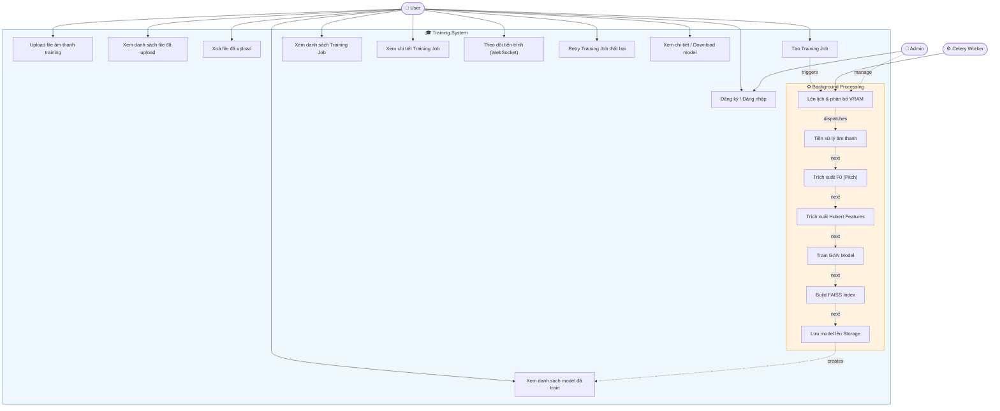
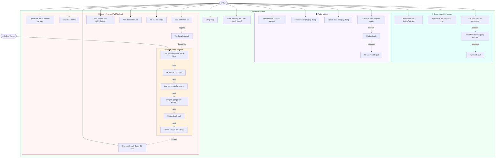
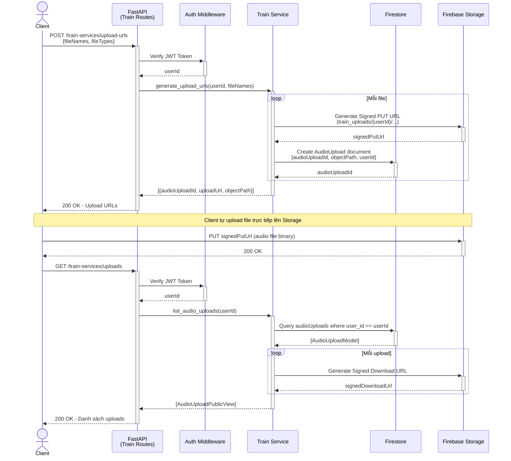
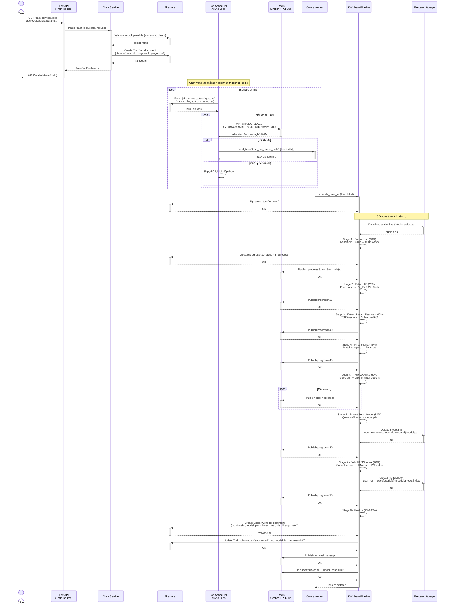
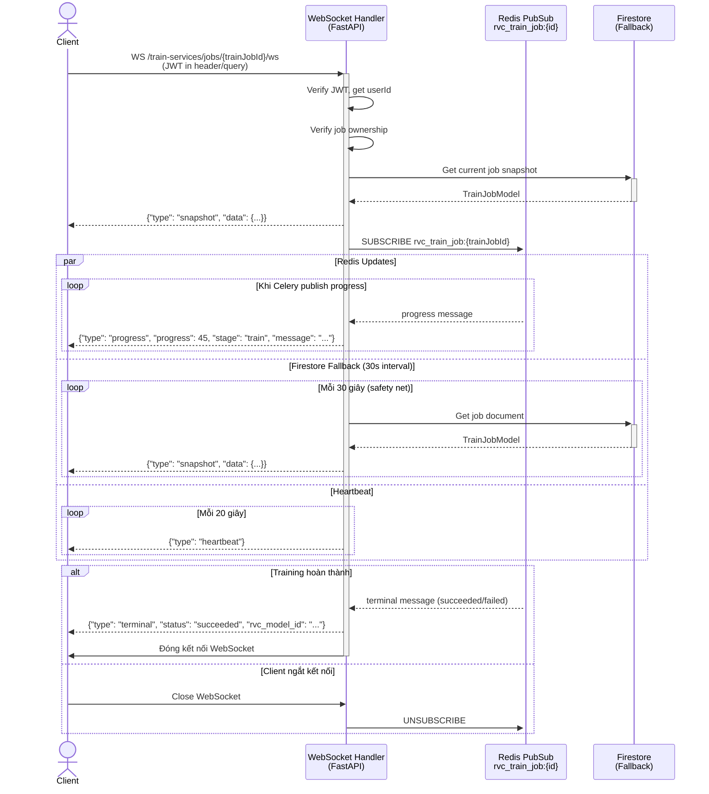
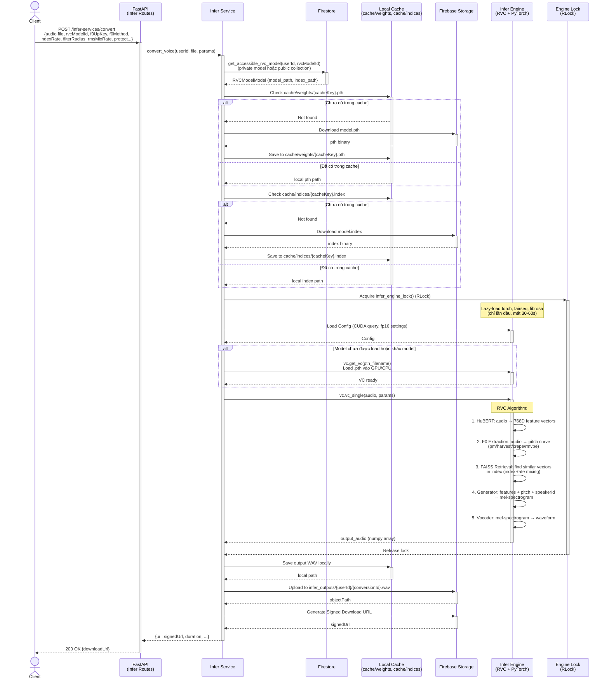
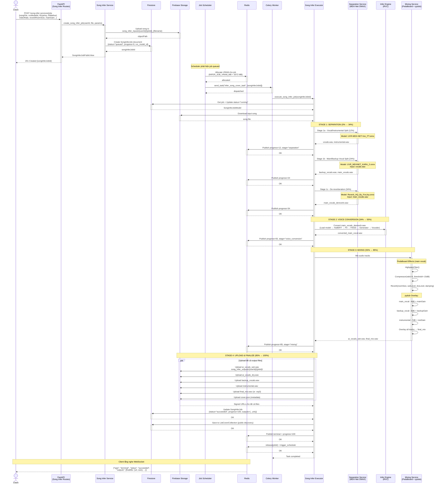
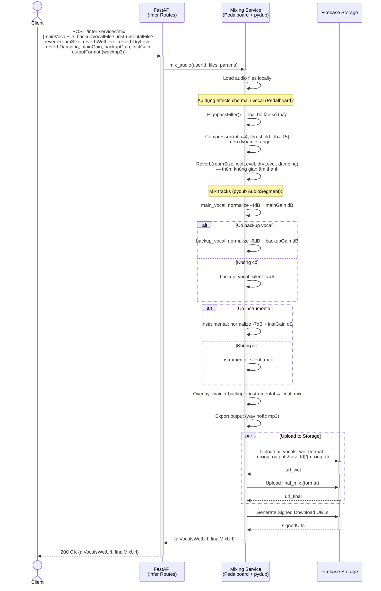
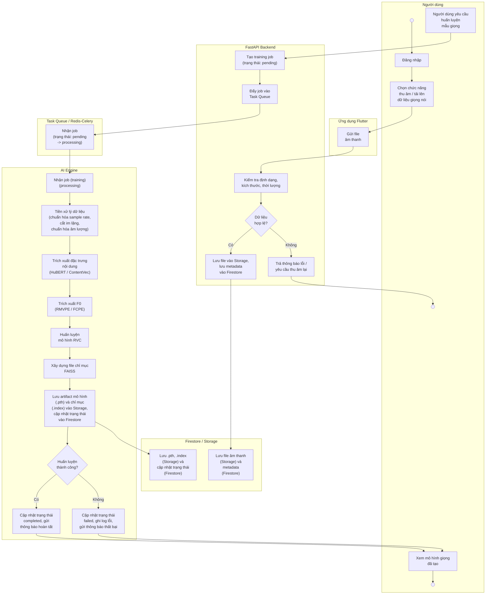

# Sơ Đồ Kiến Trúc Hệ Thống RVC Server

## Mục Lục

1. [Tổng Quan Hệ Thống](#1-tổng-quan-hệ-thống)
2. [Use Case Diagram](#2-use-case-diagram)
   - [Use Case: Training Flow](#21-use-case-training-flow)
   - [Use Case: Inference Flow](#22-use-case-inference-flow)
3. [Sequence Diagram](#3-sequence-diagram)
   - [Training: Upload Audio](#31-sequence-upload-audio-training)
   - [Training: Tạo & Thực Thi Job](#32-sequence-tạo--thực-thi-training-job)
   - [Training: Theo Dõi Tiến Trình (WebSocket)](#33-sequence-theo-dõi-tiến-trình-websocket)
   - [Inference: Direct Voice Conversion](#34-sequence-direct-voice-conversion)
   - [Song Inference: Full Pipeline](#35-sequence-song-inference-full-pipeline)
   - [Inference: Audio Mixing](#36-sequence-audio-mixing)

---

## 1. Tổng Quan Hệ Thống

```
┌─────────────────────────────────────────────────────────────────────┐
│                        RVC My Server                                │
│                                                                     │
│  ┌─────────────┐   ┌──────────────┐   ┌────────────────────────┐   │
│  │  Train API  │   │  Infer API   │   │   Song Infer API       │   │
│  │  (FastAPI)  │   │  (FastAPI)   │   │   (FastAPI)            │   │
│  └──────┬──────┘   └──────┬───────┘   └──────────┬─────────────┘   │
│         │                 │                       │                 │
│  ┌──────▼──────────────────▼───────────────────────▼─────────────┐  │
│  │                  Job Scheduler (Async Loop)                    │  │
│  │         [VRAM Budget Management + Redis Allocation]            │  │
│  └──────────────────────────┬────────────────────────────────────┘  │
│                             │                                       │
│  ┌──────────────────────────▼────────────────────────────────────┐  │
│  │                   Celery Workers (Redis)                       │  │
│  │  ┌──────────────────┐    ┌──────────────────────────────────┐ │  │
│  │  │ train_rvc_model  │    │     infer_song_cover             │ │  │
│  │  │     _task        │    │         _task                    │ │  │
│  │  └──────────────────┘    └──────────────────────────────────┘ │  │
│  └───────────────────────────────────────────────────────────────┘  │
│                                                                     │
│  External: Firebase Storage | Firestore | Redis Pub/Sub            │
└─────────────────────────────────────────────────────────────────────┘
```

**Deployment Roles:**
| Role | Mục đích | GPU | Nền tảng |
|------|----------|-----|----------|
| `all` | Toàn bộ hệ thống | Có | VM với GPU |
| `light` | API only, không infer | Không | Cloud Run (CPU) |
| `infer` | Chỉ infer/separation | Có | Cloud Run (GPU) |

---

## 2. Use Case Diagram

### 2.1 Use Case: Training Flow



### 2.2 Use Case: Inference Flow



---

## 3. Sequence Diagram

### 3.1 Sequence: Upload Audio (Training)



---

### 3.2 Sequence: Tạo & Thực Thi Training Job



---

### 3.3 Sequence: Theo Dõi Tiến Trình (WebSocket)



---

### 3.4 Sequence: Direct Voice Conversion



---

### 3.5 Sequence: Song Inference (Full Pipeline)



---

### 3.6 Sequence: Audio Mixing



---

## Tóm Tắt Kiến Trúc

### Training Flow
```
Client → Upload URLs API → Firebase Storage (trực tiếp)
      → Create Job API → Firestore (status=queued)
      ← WebSocket ←─────────────────────────────┐
                                                 │
Scheduler (3s poll + Redis trigger)              │
      → Allocate VRAM (Redis atomic)             │
      → Celery Worker                            │
           ↓ 8 Stages:                           │
           Preprocess → Extract F0 → Hubert → Train GAN
           → Extract Model → Build FAISS Index   │
           → Upload to Storage → Update Firestore │
           → Publish to Redis PubSub ────────────┘
```

### Inference Flow
```
[Direct]  Client → Infer API → Lookup Model (Firestore)
                             → Download .pth/.index (cache)
                             → RVC Engine (HuBERT + F0 + FAISS + GAN)
                             → Upload result → Return signed URL

[Song]    Client → Song Infer API → Upload song (Storage) → Firestore (queued)
                ← WebSocket ←──────────────────────────────────────┐
          Scheduler → Celery Worker                                 │
               → MDX-Net: Vocal/Inst split → Main/Backup split     │
               → De-reverb → RVC Engine → Mixing (Pedalboard+pydub)│
               → Upload all outputs → Firestore (succeeded) ───────┘
```

